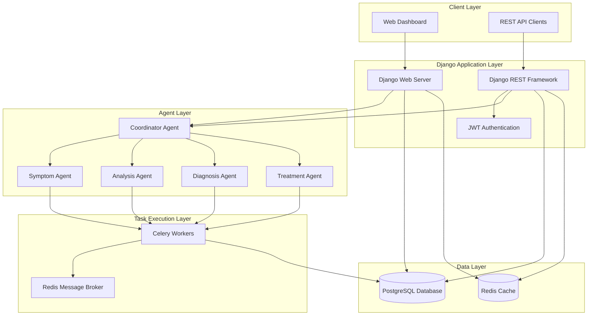
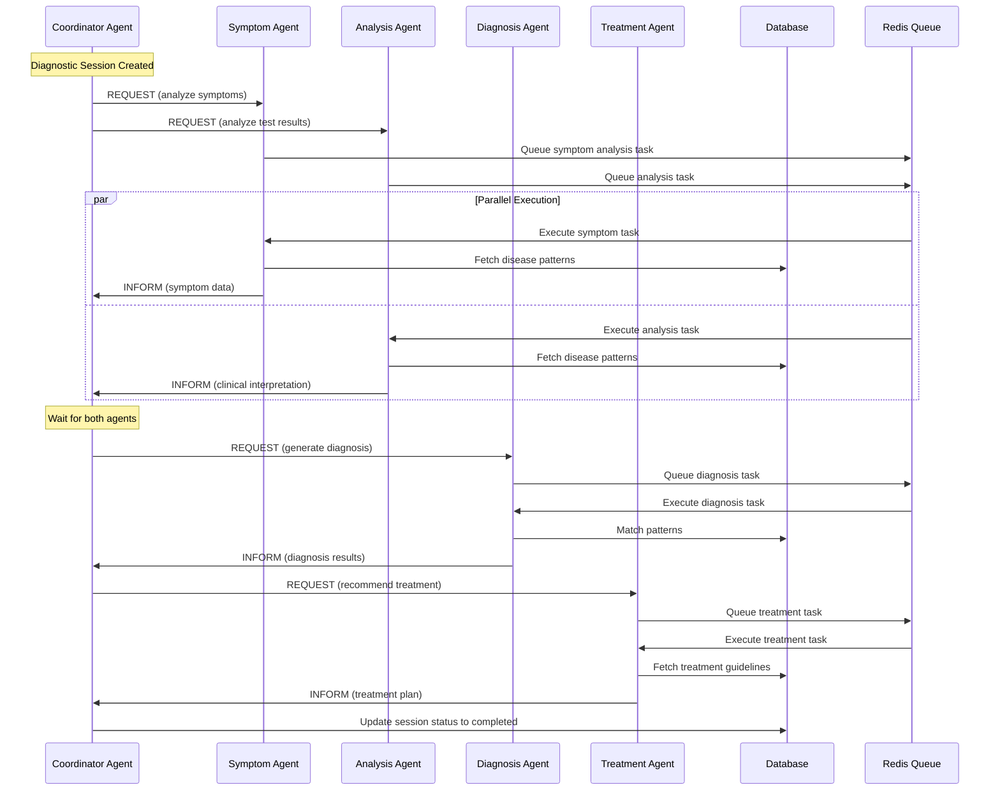
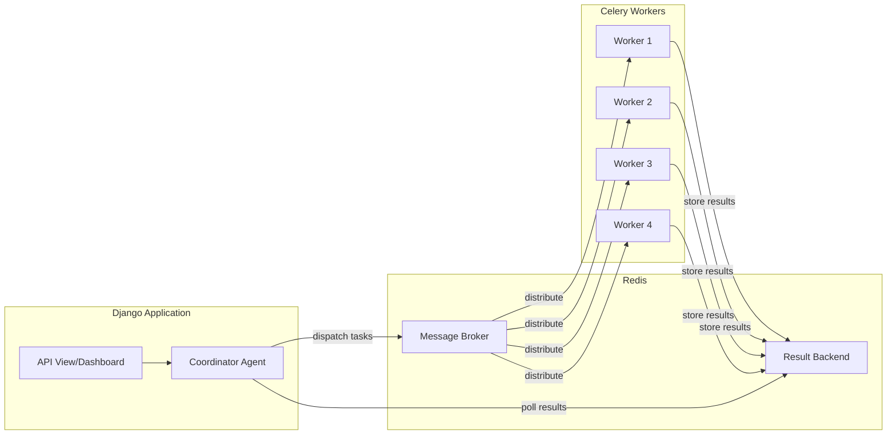

# Design Document: Medical Multiagent Diagnostic Platform

## Overview

The Medical Multiagent Diagnostic Platform is a Django-based healthcare system implementing multiagent system concepts for medical diagnostics. The platform coordinates five specialized agents (Symptom, Analysis, Diagnosis, Treatment, and Coordinator) to analyze patient symptoms, evaluate medical test results, provide diagnoses, and recommend treatment plans.

### Key Design Principles

1. **Agent Autonomy**: Each agent operates independently with its own processing logic and state management
2. **Standardized Communication**: FIPA-ACL protocol enables structured, semantic agent interaction
3. **Parallel Execution**: Celery with Redis enables concurrent agent processing for improved performance
4. **Data Security**: Field-level encryption protects sensitive patient information
5. **Observability**: Real-time monitoring dashboard provides system visibility
6. **API-First Design**: Versioned REST API enables external system integration

### Technology Stack

- **Framework**: Django 5.x with Python 3.11+
- **Database**: PostgreSQL 15+ with pgcrypto extension
- **Task Queue**: Celery 5.x with Redis 7+ as message broker
- **API**: Django REST Framework 3.14+
- **Authentication**: JWT (djangorestframework-simplejwt)
- **Encryption**: django-fernet-fields for field-level encryption
- **Frontend**: HTMX for real-time dashboard updates
- **Deployment**: Docker with docker-compose
- **Testing**: pytest-django, factory_boy, hypothesis

## Architecture

### High-Level System Architecture



### Django Apps Structure

The platform follows Django's app-based architecture with clear separation of concerns:

```
medical_platform/
├── config/                      # Project configuration
│   ├── settings/
│   │   ├── base.py             # Base settings
│   │   ├── dev.py              # Development settings
│   │   ├── staging.py          # Staging settings
│   │   └── prod.py             # Production settings
│   ├── celery.py               # Celery configuration
│   ├── urls.py                 # Root URL configuration
│   └── wsgi.py                 # WSGI application
│
├── core/                        # Core functionality
│   ├── models.py               # Abstract base models
│   ├── exceptions.py           # Custom exceptions
│   ├── validators.py           # Custom validators
│   └── utils.py                # Utility functions
│
├── agents/                      # Agent implementation
│   ├── models.py               # Agent and ACLMessage models
│   ├── base.py                 # Abstract Agent base class
│   ├── symptom_agent.py        # Symptom Agent implementation
│   ├── analysis_agent.py       # Analysis Agent implementation
│   ├── diagnosis_agent.py      # Diagnosis Agent implementation
│   ├── treatment_agent.py      # Treatment Agent implementation
│   ├── coordinator_agent.py    # Coordinator Agent implementation
│   ├── tasks.py                # Celery tasks for agents
│   └── admin.py                # Admin interface
│
├── patients/                    # Patient management
│   ├── models.py               # Patient Record model
│   ├── serializers.py          # DRF serializers
│   ├── views.py                # API views
│   ├── permissions.py          # Custom permissions
│   └── admin.py                # Admin interface
│
├── diagnostics/                 # Diagnostic sessions
│   ├── models.py               # Diagnostic Session, Disease Pattern
│   ├── serializers.py          # DRF serializers
│   ├── views.py                # API views
│   ├── workflows.py            # Workflow orchestration
│   └── admin.py                # Admin interface
│
├── dashboard/                   # Real-time monitoring
│   ├── views.py                # Dashboard views
│   ├── templates/              # HTML templates
│   └── static/                 # CSS, JS, HTMX
│
├── api/                         # API versioning
│   ├── v1/
│   │   ├── urls.py             # V1 URL routing
│   │   └── views.py            # V1 API views
│   └── v2/
│       ├── urls.py             # V2 URL routing
│       └── views.py            # V2 API views
│
└── audit/                       # Audit logging
    ├── models.py               # Audit Log model
    ├── signals.py              # Django signals for logging
    └── admin.py                # Admin interface
```

### FIPA-ACL Communication Flow



### Celery Task Architecture



## Components and Interfaces

### Abstract Agent Base Class

The `Agent` base class provides common functionality for all specialized agents:

```python
from abc import ABC, abstractmethod
from enum import Enum
from typing import List, Optional
from django.db import models
from django.utils import timezone

class AgentState(Enum):
    """Agent operational states"""
    IDLE = "idle"
    PROCESSING = "processing"
    COMPLETED = "completed"
    ERROR = "error"

class Agent(ABC):
    """
    Abstract base class for all agents in the multiagent system.
    
    Provides common functionality for:
    - State management
    - Message handling (inbox/outbox)
    - ACL message sending/receiving
    - Task execution coordination
    """
    
    def __init__(self, agent_id: str, agent_type: str):
        self.agent_id = agent_id
        self.agent_type = agent_type
        self.state = AgentState.IDLE
        self.message_inbox: List['ACLMessage'] = []
        self.message_outbox: List['ACLMessage'] = []
        self.created_at = timezone.now()
        self.updated_at = timezone.now()
    
    @abstractmethod
    def process(self, input_data: dict) -> dict:
        """
        Process input data and return results.
        Must be implemented by all concrete agent classes.
        
        Args:
            input_data: Dictionary containing agent-specific input
            
        Returns:
            Dictionary containing processing results
            
        Raises:
            AgentProcessingError: If processing fails
        """
        pass
    
    def send_message(self, receiver_id: str, performative: str, 
                    content: dict, conversation_id: str) -> 'ACLMessage':
        """
        Send ACL message to another agent.
        
        Args:
            receiver_id: Target agent identifier
            performative: FIPA-ACL performative (REQUEST, INFORM, etc.)
            content: Message payload
            conversation_id: Conversation tracking identifier
            
        Returns:
            Created ACLMessage instance
        """
        from agents.models import ACLMessage
        
        message = ACLMessage.objects.create(
            sender_id=self.agent_id,
            receiver_id=receiver_id,
            performative=performative,
            content=content,
            conversation_id=conversation_id
        )
        self.message_outbox.append(message)
        return message
    
    def receive_messages(self) -> List['ACLMessage']:
        """
        Retrieve all pending messages from inbox.
        
        Returns:
            List of ACLMessage instances
        """
        from agents.models import ACLMessage
        
        messages = ACLMessage.objects.filter(
            receiver_id=self.agent_id,
            processed=False
        ).order_by('timestamp')
        
        self.message_inbox.extend(messages)
        return list(messages)
    
    def update_state(self, new_state: AgentState) -> None:
        """Update agent state and timestamp"""
        self.state = new_state
        self.updated_at = timezone.now()
    
    def get_state(self) -> AgentState:
        """Get current agent state"""
        return self.state
```

### Specialized Agent Implementations

#### Symptom Agent

```python
from agents.base import Agent, AgentState
from diagnostics.models import DiseasePattern
import re

class SymptomAgent(Agent):
    """
    Analyzes patient symptom descriptions and extracts structured data.
    
    Responsibilities:
    - Parse natural language symptom descriptions
    - Extract symptom keywords
    - Categorize symptoms by severity
    - Match symptoms against disease pattern database
    """
    
    def __init__(self, agent_id: str):
        super().__init__(agent_id, "symptom_agent")
        self.symptom_keywords = self._load_symptom_keywords()
    
    def process(self, input_data: dict) -> dict:
        """
        Process symptom description and extract structured data.
        
        Args:
            input_data: {
                'symptoms': str,  # Natural language description
                'patient_id': str
            }
            
        Returns:
            {
                'extracted_symptoms': List[str],
                'severity': str,  # low, medium, high
                'matched_patterns': List[str]  # Disease pattern IDs
            }
        """
        self.update_state(AgentState.PROCESSING)
        
        try:
            symptoms_text = input_data['symptoms'].lower()
            
            # Extract symptom keywords
            extracted = self._extract_keywords(symptoms_text)
            
            # Assess severity
            severity = self._assess_severity(extracted)
            
            # Match against disease patterns
            matched_patterns = self._match_patterns(extracted)
            
            self.update_state(AgentState.COMPLETED)
            
            return {
                'extracted_symptoms': extracted,
                'severity': severity,
                'matched_patterns': matched_patterns
            }
            
        except Exception as e:
            self.update_state(AgentState.ERROR)
            raise AgentProcessingError(f"Symptom analysis failed: {str(e)}")
    
    def _extract_keywords(self, text: str) -> List[str]:
        """Extract symptom keywords from text"""
        found_symptoms = []
        for keyword in self.symptom_keywords:
            if keyword in text:
                found_symptoms.append(keyword)
        return found_symptoms
    
    def _assess_severity(self, symptoms: List[str]) -> str:
        """Assess symptom severity based on keywords"""
        high_severity_keywords = ['severe', 'acute', 'intense', 'unbearable']
        
        if any(kw in ' '.join(symptoms) for kw in high_severity_keywords):
            return 'high'
        elif len(symptoms) > 5:
            return 'medium'
        else:
            return 'low'
    
    def _match_patterns(self, symptoms: List[str]) -> List[str]:
        """Match symptoms against disease patterns"""
        patterns = DiseasePattern.objects.filter(
            symptom_keywords__overlap=symptoms
        )
        return [str(p.pattern_id) for p in patterns]
    
    def _load_symptom_keywords(self) -> List[str]:
        """Load symptom keywords from database"""
        patterns = DiseasePattern.objects.all()
        keywords = set()
        for pattern in patterns:
            keywords.update(pattern.symptom_keywords)
        return list(keywords)
```

#### Analysis Agent

```python
from agents.base import Agent, AgentState
import json

class AnalysisAgent(Agent):
    """
    Evaluates medical test results and generates clinical interpretations.
    
    Responsibilities:
    - Parse test result data
    - Compare against normal ranges
    - Generate clinical interpretations
    - Flag abnormal results
    """
    
    def __init__(self, agent_id: str):
        super().__init__(agent_id, "analysis_agent")
        self.normal_ranges = self._load_normal_ranges()
    
    def process(self, input_data: dict) -> dict:
        """
        Process test results and generate clinical interpretation.
        
        Args:
            input_data: {
                'test_results': str,  # JSON string
                'patient_id': str
            }
            
        Returns:
            {
                'parsed_results': dict,
                'abnormal_flags': List[str],
                'clinical_interpretation': str
            }
        """
        self.update_state(AgentState.PROCESSING)
        
        try:
            # Parse test results JSON
            test_data = json.loads(input_data['test_results'])
            
            # Identify abnormal results
            abnormal = self._identify_abnormal(test_data)
            
            # Generate interpretation
            interpretation = self._generate_interpretation(test_data, abnormal)
            
            self.update_state(AgentState.COMPLETED)
            
            return {
                'parsed_results': test_data,
                'abnormal_flags': abnormal,
                'clinical_interpretation': interpretation
            }
            
        except json.JSONDecodeError as e:
            self.update_state(AgentState.ERROR)
            raise AgentProcessingError(f"Invalid test results JSON: {str(e)}")
        except Exception as e:
            self.update_state(AgentState.ERROR)
            raise AgentProcessingError(f"Analysis failed: {str(e)}")
    
    def _identify_abnormal(self, test_data: dict) -> List[str]:
        """Identify test results outside normal ranges"""
        abnormal = []
        for test_name, value in test_data.items():
            if test_name in self.normal_ranges:
                min_val, max_val = self.normal_ranges[test_name]
                if not (min_val <= value <= max_val):
                    abnormal.append(test_name)
        return abnormal
    
    def _generate_interpretation(self, test_data: dict, 
                                abnormal: List[str]) -> str:
        """Generate clinical interpretation text"""
        if not abnormal:
            return "All test results within normal ranges."
        
        interpretation = f"Abnormal results detected: {', '.join(abnormal)}. "
        # Add specific interpretations based on abnormal tests
        return interpretation
    
    def _load_normal_ranges(self) -> dict:
        """Load normal test result ranges"""
        return {
            'blood_glucose': (70, 100),
            'cholesterol': (0, 200),
            'blood_pressure_systolic': (90, 120),
            'blood_pressure_diastolic': (60, 80),
            'heart_rate': (60, 100)
        }
```

#### Diagnosis Agent

```python
from agents.base import Agent, AgentState
from diagnostics.models import DiseasePattern

class DiagnosisAgent(Agent):
    """
    Generates potential diagnoses based on symptom and analysis data.
    
    Responsibilities:
    - Combine symptom and test result data
    - Match against disease pattern knowledge base
    - Rank diagnoses by confidence
    - Generate differential diagnosis list
    """
    
    def __init__(self, agent_id: str):
        super().__init__(agent_id, "diagnosis_agent")
    
    def process(self, input_data: dict) -> dict:
        """
        Generate diagnosis based on symptoms and test results.
        
        Args:
            input_data: {
                'symptom_data': dict,  # From Symptom Agent
                'analysis_data': dict,  # From Analysis Agent
                'patient_id': str
            }
            
        Returns:
            {
                'primary_diagnosis': str,
                'confidence': float,
                'differential_diagnoses': List[dict],
                'reasoning': str
            }
        """
        self.update_state(AgentState.PROCESSING)
        
        try:
            symptoms = input_data['symptom_data']['extracted_symptoms']
            abnormal_tests = input_data['analysis_data']['abnormal_flags']
            
            # Match against disease patterns
            matches = self._match_disease_patterns(symptoms, abnormal_tests)
            
            # Rank by confidence
            ranked = self._rank_diagnoses(matches)
            
            # Generate reasoning
            reasoning = self._generate_reasoning(ranked[0] if ranked else None)
            
            self.update_state(AgentState.COMPLETED)
            
            return {
                'primary_diagnosis': ranked[0]['disease_name'] if ranked else 'Unknown',
                'confidence': ranked[0]['confidence'] if ranked else 0.0,
                'differential_diagnoses': ranked[1:4],  # Top 3 alternatives
                'reasoning': reasoning
            }
            
        except Exception as e:
            self.update_state(AgentState.ERROR)
            raise AgentProcessingError(f"Diagnosis generation failed: {str(e)}")
    
    def _match_disease_patterns(self, symptoms: List[str], 
                               abnormal_tests: List[str]) -> List[dict]:
        """Match symptoms and tests against disease patterns"""
        patterns = DiseasePattern.objects.all()
        matches = []
        
        for pattern in patterns:
            symptom_match = len(set(symptoms) & set(pattern.symptom_keywords))
            test_match = len(set(abnormal_tests) & set(pattern.required_tests))
            
            if symptom_match > 0 or test_match > 0:
                matches.append({
                    'disease_name': pattern.disease_name,
                    'symptom_match_count': symptom_match,
                    'test_match_count': test_match,
                    'pattern_id': str(pattern.pattern_id)
                })
        
        return matches
    
    def _rank_diagnoses(self, matches: List[dict]) -> List[dict]:
        """Rank diagnoses by confidence score"""
        for match in matches:
            # Simple confidence calculation
            confidence = (match['symptom_match_count'] * 0.6 + 
                         match['test_match_count'] * 0.4) / 10
            match['confidence'] = min(confidence, 1.0)
        
        return sorted(matches, key=lambda x: x['confidence'], reverse=True)
    
    def _generate_reasoning(self, diagnosis: Optional[dict]) -> str:
        """Generate reasoning for diagnosis"""
        if not diagnosis:
            return "Insufficient data for diagnosis."
        
        return (f"Diagnosis based on {diagnosis['symptom_match_count']} "
                f"matching symptoms and {diagnosis['test_match_count']} "
                f"matching test results.")
```

#### Treatment Agent

```python
from agents.base import Agent, AgentState
from diagnostics.models import DiseasePattern

class TreatmentAgent(Agent):
    """
    Recommends treatment plans based on confirmed diagnoses.
    
    Responsibilities:
    - Retrieve treatment guidelines for diagnosis
    - Consider patient allergies and contraindications
    - Generate personalized treatment plan
    - Provide medication and lifestyle recommendations
    """
    
    def __init__(self, agent_id: str):
        super().__init__(agent_id, "treatment_agent")
    
    def process(self, input_data: dict) -> dict:
        """
        Generate treatment plan based on diagnosis.
        
        Args:
            input_data: {
                'diagnosis_data': dict,  # From Diagnosis Agent
                'patient_id': str,
                'patient_allergies': List[str]
            }
            
        Returns:
            {
                'treatment_plan': str,
                'medications': List[dict],
                'lifestyle_recommendations': List[str],
                'follow_up': str
            }
        """
        self.update_state(AgentState.PROCESSING)
        
        try:
            diagnosis = input_data['diagnosis_data']['primary_diagnosis']
            allergies = input_data.get('patient_allergies', [])
            
            # Retrieve treatment guidelines
            guidelines = self._get_treatment_guidelines(diagnosis)
            
            # Filter medications based on allergies
            safe_medications = self._filter_medications(
                guidelines.get('medications', []), 
                allergies
            )
            
            # Generate treatment plan
            plan = self._generate_treatment_plan(diagnosis, safe_medications)
            
            self.update_state(AgentState.COMPLETED)
            
            return {
                'treatment_plan': plan,
                'medications': safe_medications,
                'lifestyle_recommendations': guidelines.get('lifestyle', []),
                'follow_up': guidelines.get('follow_up', 'Schedule follow-up in 2 weeks')
            }
            
        except Exception as e:
            self.update_state(AgentState.ERROR)
            raise AgentProcessingError(f"Treatment planning failed: {str(e)}")
    
    def _get_treatment_guidelines(self, diagnosis: str) -> dict:
        """Retrieve treatment guidelines from disease pattern"""
        try:
            pattern = DiseasePattern.objects.get(disease_name=diagnosis)
            return pattern.treatment_guidelines
        except DiseasePattern.DoesNotExist:
            return {
                'medications': [],
                'lifestyle': ['Consult with specialist'],
                'follow_up': 'Schedule follow-up as needed'
            }
    
    def _filter_medications(self, medications: List[dict], 
                           allergies: List[str]) -> List[dict]:
        """Filter out medications that conflict with allergies"""
        safe_meds = []
        for med in medications:
            if not any(allergy in med.get('contraindications', []) 
                      for allergy in allergies):
                safe_meds.append(med)
        return safe_meds
    
    def _generate_treatment_plan(self, diagnosis: str, 
                                medications: List[dict]) -> str:
        """Generate comprehensive treatment plan text"""
        plan = f"Treatment Plan for {diagnosis}:\n\n"
        
        if medications:
            plan += "Medications:\n"
            for med in medications:
                plan += f"- {med['name']}: {med['dosage']}\n"
        else:
            plan += "No medications recommended at this time.\n"
        
        return plan
```

#### Coordinator Agent

```python
from agents.base import Agent, AgentState
from agents.tasks import (
    symptom_analysis_task,
    analysis_task,
    diagnosis_task,
    treatment_task
)
from celery import group, chain
from diagnostics.models import DiagnosticSession

class CoordinatorAgent(Agent):
    """
    Master agent that orchestrates all other agents in the diagnostic workflow.
    
    Responsibilities:
    - Manage diagnostic session lifecycle
    - Dispatch tasks to specialized agents
    - Coordinate parallel execution
    - Handle agent failures and retries
    - Update session status
    """
    
    def __init__(self, agent_id: str):
        super().__init__(agent_id, "coordinator_agent")
    
    def process(self, input_data: dict) -> dict:
        """
        Orchestrate complete diagnostic workflow.
        
        Args:
            input_data: {
                'session_id': str,
                'patient_id': str,
                'symptoms': str,
                'test_results': str
            }
            
        Returns:
            {
                'session_id': str,
                'status': str,
                'workflow_id': str
            }
        """
        self.update_state(AgentState.PROCESSING)
        
        try:
            session_id = input_data['session_id']
            conversation_id = f"conv_{session_id}"
            
            # Phase 1: Parallel execution of Symptom and Analysis agents
            phase1 = group(
                symptom_analysis_task.s(
                    agent_id=f"symptom_{session_id}",
                    input_data={
                        'symptoms': input_data['symptoms'],
                        'patient_id': input_data['patient_id']
                    },
                    conversation_id=conversation_id
                ),
                analysis_task.s(
                    agent_id=f"analysis_{session_id}",
                    input_data={
                        'test_results': input_data['test_results'],
                        'patient_id': input_data['patient_id']
                    },
                    conversation_id=conversation_id
                )
            )
            
            # Phase 2: Diagnosis agent (waits for phase 1)
            phase2 = diagnosis_task.s(
                agent_id=f"diagnosis_{session_id}",
                conversation_id=conversation_id
            )
            
            # Phase 3: Treatment agent (waits for phase 2)
            phase3 = treatment_task.s(
                agent_id=f"treatment_{session_id}",
                conversation_id=conversation_id
            )
            
            # Chain the workflow
            workflow = chain(phase1, phase2, phase3)
            result = workflow.apply_async()
            
            # Update session
            session = DiagnosticSession.objects.get(session_id=session_id)
            session.status = 'processing'
            session.celery_task_id = result.id
            session.save()
            
            self.update_state(AgentState.COMPLETED)
            
            return {
                'session_id': session_id,
                'status': 'processing',
                'workflow_id': result.id
            }
            
        except Exception as e:
            self.update_state(AgentState.ERROR)
            raise AgentProcessingError(f"Workflow orchestration failed: {str(e)}")
    
    def handle_agent_failure(self, agent_id: str, error: str, 
                           conversation_id: str) -> None:
        """Handle failure from specialized agent"""
        # Send FAILURE message
        self.send_message(
            receiver_id=agent_id,
            performative='FAILURE',
            content={'error': error},
            conversation_id=conversation_id
        )
        
        # Update session status
        session_id = conversation_id.replace('conv_', '')
        session = DiagnosticSession.objects.get(session_id=session_id)
        session.status = 'failed'
        session.error_message = error
        session.save()
```


## Data Models

### ACL Message Model

```python
from django.db import models
from django.core.validators import MinLengthValidator
import uuid

class ACLMessage(models.Model):
    """
    FIPA-ACL compliant message for agent communication.
    
    Implements standard FIPA-ACL message structure with performatives
    for semantic agent interaction.
    """
    
    class Performative(models.TextChoices):
        """FIPA-ACL performatives"""
        INFORM = 'INFORM', 'Inform'
        REQUEST = 'REQUEST', 'Request'
        QUERY = 'QUERY', 'Query'
        AGREE = 'AGREE', 'Agree'
        REFUSE = 'REFUSE', 'Refuse'
        FAILURE = 'FAILURE', 'Failure'
        CONFIRM = 'CONFIRM', 'Confirm'
    
    message_id = models.UUIDField(
        primary_key=True,
        default=uuid.uuid4,
        editable=False
    )
    sender_id = models.CharField(
        max_length=255,
        validators=[MinLengthValidator(1)],
        db_index=True
    )
    receiver_id = models.CharField(
        max_length=255,
        validators=[MinLengthValidator(1)],
        db_index=True
    )
    performative = models.CharField(
        max_length=20,
        choices=Performative.choices
    )
    content = models.JSONField()
    conversation_id = models.CharField(
        max_length=255,
        db_index=True
    )
    reply_to = models.UUIDField(
        null=True,
        blank=True
    )
    timestamp = models.DateTimeField(
        auto_now_add=True,
        db_index=True
    )
    processed = models.BooleanField(
        default=False,
        db_index=True
    )
    
    class Meta:
        db_table = 'acl_messages'
        ordering = ['-timestamp']
        indexes = [
            models.Index(fields=['conversation_id', 'timestamp']),
            models.Index(fields=['receiver_id', 'processed']),
        ]
    
    def __str__(self):
        return f"{self.performative}: {self.sender_id} -> {self.receiver_id}"
```

### Patient Record Model

```python
from django.db import models
from django.core.validators import MinLengthValidator
from fernet_fields import EncryptedTextField, EncryptedJSONField
import uuid

class PatientRecord(models.Model):
    """
    Patient medical record with encrypted sensitive fields.
    
    Implements field-level encryption for HIPAA compliance.
    """
    
    class Gender(models.TextChoices):
        MALE = 'M', 'Male'
        FEMALE = 'F', 'Female'
        OTHER = 'O', 'Other'
        PREFER_NOT_TO_SAY = 'N', 'Prefer not to say'
    
    patient_id = models.UUIDField(
        primary_key=True,
        default=uuid.uuid4,
        editable=False
    )
    user = models.OneToOneField(
        'auth.User',
        on_delete=models.CASCADE,
        related_name='patient_record'
    )
    full_name = models.CharField(
        max_length=255,
        validators=[MinLengthValidator(1)]
    )
    date_of_birth = models.DateField()
    gender = models.CharField(
        max_length=1,
        choices=Gender.choices
    )
    blood_type = models.CharField(
        max_length=3,
        blank=True
    )
    # Encrypted fields for sensitive data
    allergies = EncryptedJSONField(
        default=list,
        help_text="List of patient allergies"
    )
    medical_history = EncryptedTextField(
        blank=True,
        help_text="Complete medical history"
    )
    
    # Soft deletion
    is_deleted = models.BooleanField(
        default=False,
        db_index=True
    )
    deleted_at = models.DateTimeField(
        null=True,
        blank=True
    )
    
    created_at = models.DateTimeField(auto_now_add=True)
    updated_at = models.DateTimeField(auto_now=True)
    
    class Meta:
        db_table = 'patient_records'
        ordering = ['-created_at']
        indexes = [
            models.Index(fields=['user', 'is_deleted']),
        ]
    
    def __str__(self):
        return f"{self.full_name} ({self.patient_id})"
    
    def soft_delete(self):
        """Soft delete patient record"""
        from django.utils import timezone
        self.is_deleted = True
        self.deleted_at = timezone.now()
        self.save()
```

### Diagnostic Session Model

```python
from django.db import models
from django.core.validators import MinLengthValidator
import uuid

class DiagnosticSession(models.Model):
    """
    Complete diagnostic workflow instance.
    
    Tracks the entire diagnostic process from symptom input
    to treatment recommendation.
    """
    
    class Status(models.TextChoices):
        INITIATED = 'initiated', 'Initiated'
        PROCESSING = 'processing', 'Processing'
        COMPLETED = 'completed', 'Completed'
        FAILED = 'failed', 'Failed'
    
    session_id = models.UUIDField(
        primary_key=True,
        default=uuid.uuid4,
        editable=False
    )
    patient = models.ForeignKey(
        'patients.PatientRecord',
        on_delete=models.CASCADE,
        related_name='diagnostic_sessions'
    )
    symptoms = models.TextField(
        validators=[MinLengthValidator(10)]
    )
    test_results = models.JSONField()
    
    # Results from agents
    symptom_data = models.JSONField(null=True, blank=True)
    analysis_data = models.JSONField(null=True, blank=True)
    diagnosis = models.JSONField(null=True, blank=True)
    treatment_plan = models.JSONField(null=True, blank=True)
    
    status = models.CharField(
        max_length=20,
        choices=Status.choices,
        default=Status.INITIATED,
        db_index=True
    )
    error_message = models.TextField(blank=True)
    
    # Celery task tracking
    celery_task_id = models.CharField(
        max_length=255,
        blank=True,
        db_index=True
    )
    
    created_at = models.DateTimeField(
        auto_now_add=True,
        db_index=True
    )
    completed_at = models.DateTimeField(null=True, blank=True)
    
    class Meta:
        db_table = 'diagnostic_sessions'
        ordering = ['-created_at']
        indexes = [
            models.Index(fields=['patient', 'status']),
            models.Index(fields=['status', 'created_at']),
        ]
    
    def __str__(self):
        return f"Session {self.session_id} - {self.status}"
    
    def mark_completed(self):
        """Mark session as completed"""
        from django.utils import timezone
        self.status = self.Status.COMPLETED
        self.completed_at = timezone.now()
        self.save()
```

### Disease Pattern Model

```python
from django.db import models
from django.contrib.postgres.fields import ArrayField
from django.core.validators import MinLengthValidator
import uuid

class DiseasePattern(models.Model):
    """
    Knowledge base entry for disease diagnosis and treatment.
    
    Contains symptom-diagnosis-treatment mappings used by agents.
    """
    
    pattern_id = models.UUIDField(
        primary_key=True,
        default=uuid.uuid4,
        editable=False
    )
    disease_name = models.CharField(
        max_length=255,
        unique=True,
        validators=[MinLengthValidator(1)],
        db_index=True
    )
    symptom_keywords = ArrayField(
        models.CharField(max_length=100),
        help_text="List of symptom keywords"
    )
    required_tests = ArrayField(
        models.CharField(max_length=100),
        default=list,
        blank=True,
        help_text="List of required test names"
    )
    typical_results = models.JSONField(
        default=dict,
        help_text="Typical test result ranges"
    )
    treatment_guidelines = models.JSONField(
        help_text="Treatment recommendations"
    )
    
    created_at = models.DateTimeField(auto_now_add=True)
    updated_at = models.DateTimeField(auto_now=True)
    updated_by = models.ForeignKey(
        'auth.User',
        on_delete=models.SET_NULL,
        null=True,
        related_name='updated_patterns'
    )
    
    class Meta:
        db_table = 'disease_patterns'
        ordering = ['disease_name']
        indexes = [
            models.Index(fields=['disease_name']),
        ]
    
    def __str__(self):
        return self.disease_name
```

### Audit Log Model

```python
from django.db import models
import uuid

class AuditLog(models.Model):
    """
    Audit trail for all system activities.
    
    Maintains compliance with healthcare regulatory requirements.
    """
    
    class Action(models.TextChoices):
        CREATE = 'CREATE', 'Create'
        UPDATE = 'UPDATE', 'Update'
        DELETE = 'DELETE', 'Delete'
        VIEW = 'VIEW', 'View'
    
    log_id = models.UUIDField(
        primary_key=True,
        default=uuid.uuid4,
        editable=False
    )
    user = models.ForeignKey(
        'auth.User',
        on_delete=models.SET_NULL,
        null=True,
        related_name='audit_logs'
    )
    action = models.CharField(
        max_length=10,
        choices=Action.choices,
        db_index=True
    )
    model_name = models.CharField(
        max_length=100,
        db_index=True
    )
    record_id = models.CharField(max_length=255)
    changes = models.JSONField(
        help_text="JSON diff of changes"
    )
    timestamp = models.DateTimeField(
        auto_now_add=True,
        db_index=True
    )
    ip_address = models.GenericIPAddressField(null=True, blank=True)
    user_agent = models.TextField(blank=True)
    
    class Meta:
        db_table = 'audit_logs'
        ordering = ['-timestamp']
        indexes = [
            models.Index(fields=['user', 'timestamp']),
            models.Index(fields=['model_name', 'action', 'timestamp']),
        ]
    
    def __str__(self):
        return f"{self.action} on {self.model_name} at {self.timestamp}"
```

## API Design

### RESTful Endpoints

The platform implements a versioned REST API using Django REST Framework:

#### API v1 Endpoints

```
/api/v1/auth/
    POST   /login/              # JWT token authentication
    POST   /register/           # User registration
    POST   /refresh/            # Refresh JWT token
    POST   /logout/             # Invalidate token

/api/v1/patients/
    GET    /                    # List patients (admin) or own record (patient)
    POST   /                    # Create patient record
    GET    /{patient_id}/       # Retrieve patient details
    PUT    /{patient_id}/       # Update patient record
    PATCH  /{patient_id}/       # Partial update
    DELETE /{patient_id}/       # Soft delete patient

/api/v1/sessions/
    GET    /                    # List diagnostic sessions
    POST   /                    # Create new session
    GET    /{session_id}/       # Retrieve session details
    GET    /{session_id}/status/ # Get session status
    POST   /{session_id}/cancel/ # Cancel session

/api/v1/agents/
    GET    /                    # List all agents
    GET    /{agent_id}/         # Get agent details
    GET    /{agent_id}/state/   # Get agent state
    GET    /{agent_id}/messages/ # Get agent messages

/api/v1/messages/
    GET    /                    # List ACL messages
    GET    /{message_id}/       # Retrieve message details
    GET    /conversation/{conv_id}/ # Get conversation messages

/api/v1/patterns/
    GET    /                    # List disease patterns
    POST   /                    # Create pattern (admin only)
    GET    /{pattern_id}/       # Retrieve pattern
    PUT    /{pattern_id}/       # Update pattern (admin only)
    DELETE /{pattern_id}/       # Delete pattern (admin only)
    GET    /search/             # Search patterns by keywords
```

### Request/Response Schemas

#### Create Diagnostic Session

**Request:**
```json
POST /api/v1/sessions/
Content-Type: application/json
Authorization: Bearer <jwt_token>

{
  "patient_id": "550e8400-e29b-41d4-a716-446655440000",
  "symptoms": "Experiencing severe headache, fever, and fatigue for 3 days",
  "test_results": {
    "blood_glucose": 95,
    "cholesterol": 180,
    "blood_pressure_systolic": 130,
    "blood_pressure_diastolic": 85
  }
}
```

**Response:**
```json
HTTP 201 Created
X-API-Version: v1

{
  "data": {
    "session_id": "7c9e6679-7425-40de-944b-e07fc1f90ae7",
    "patient_id": "550e8400-e29b-41d4-a716-446655440000",
    "status": "initiated",
    "created_at": "2024-01-15T10:30:00Z",
    "workflow_id": "celery-task-id-12345"
  },
  "meta": {
    "version": "v1",
    "timestamp": "2024-01-15T10:30:00Z"
  },
  "errors": []
}
```

#### Get Session Status

**Request:**
```json
GET /api/v1/sessions/7c9e6679-7425-40de-944b-e07fc1f90ae7/status/
Authorization: Bearer <jwt_token>
```

**Response:**
```json
HTTP 200 OK

{
  "data": {
    "session_id": "7c9e6679-7425-40de-944b-e07fc1f90ae7",
    "status": "processing",
    "agents": {
      "symptom_agent": "completed",
      "analysis_agent": "completed",
      "diagnosis_agent": "processing",
      "treatment_agent": "idle"
    },
    "progress": 60,
    "estimated_completion": "2024-01-15T10:35:00Z"
  },
  "meta": {
    "version": "v1",
    "timestamp": "2024-01-15T10:32:00Z"
  },
  "errors": []
}
```

### Authentication and Authorization

#### JWT Token Structure

```python
from rest_framework_simplejwt.serializers import TokenObtainPairSerializer
from rest_framework_simplejwt.views import TokenObtainPairView

class CustomTokenObtainPairSerializer(TokenObtainPairSerializer):
    """Custom JWT token with additional claims"""
    
    @classmethod
    def get_token(cls, user):
        token = super().get_token(user)
        
        # Add custom claims
        token['role'] = 'admin' if user.is_staff else 'patient'
        token['patient_id'] = str(user.patient_record.patient_id) if hasattr(user, 'patient_record') else None
        
        return token

class CustomTokenObtainPairView(TokenObtainPairView):
    serializer_class = CustomTokenObtainPairSerializer
```

#### Permission Classes

```python
from rest_framework import permissions

class IsAdminOrOwner(permissions.BasePermission):
    """
    Custom permission: Admin users have full access,
    Patient users can only access their own records.
    """
    
    def has_permission(self, request, view):
        return request.user and request.user.is_authenticated
    
    def has_object_permission(self, request, view, obj):
        # Admin users have full access
        if request.user.is_staff:
            return True
        
        # Patient users can only access their own records
        if hasattr(obj, 'patient'):
            return obj.patient.user == request.user
        elif hasattr(obj, 'user'):
            return obj.user == request.user
        
        return False

class IsAdminUser(permissions.BasePermission):
    """Admin-only permission"""
    
    def has_permission(self, request, view):
        return request.user and request.user.is_staff
```

### Error Handling

#### Standard Error Response Format

```json
{
  "data": null,
  "meta": {
    "version": "v1",
    "timestamp": "2024-01-15T10:30:00Z"
  },
  "errors": [
    {
      "code": "VALIDATION_ERROR",
      "message": "Symptom description must be at least 10 characters",
      "field": "symptoms",
      "detail": "Ensure this field has at least 10 characters."
    }
  ]
}
```

#### Custom Exception Classes

```python
from rest_framework.exceptions import APIException

class AgentCommunicationError(APIException):
    status_code = 503
    default_detail = 'Agent communication failed'
    default_code = 'agent_communication_error'

class DiagnosticSessionError(APIException):
    status_code = 500
    default_detail = 'Diagnostic session processing failed'
    default_code = 'diagnostic_session_error'

class ValidationError(APIException):
    status_code = 400
    default_detail = 'Validation failed'
    default_code = 'validation_error'
```

## Real-Time Monitoring Dashboard

### Dashboard Architecture

The dashboard uses HTMX for real-time updates without full page reloads:

```html
<!-- dashboard/templates/dashboard/index.html -->
<!DOCTYPE html>
<html>
<head>
    <title>Medical Multiagent Platform - Dashboard</title>
    <script src="https://unpkg.com/htmx.org@1.9.10"></script>
    <style>
        .agent-card { border: 1px solid #ccc; padding: 1rem; margin: 0.5rem; }
        .agent-idle { background-color: #e8f5e9; }
        .agent-processing { background-color: #fff3e0; }
        .agent-completed { background-color: #e3f2fd; }
        .agent-error { background-color: #ffebee; }
    </style>
</head>
<body>
    <h1>System Dashboard</h1>
    
    <!-- Agent Status Section -->
    <div id="agent-status" 
         hx-get="/dashboard/agents/status/" 
         hx-trigger="every 2s"
         hx-swap="innerHTML">
        <!-- Agent status cards will be loaded here -->
    </div>
    
    <!-- Active Sessions Section -->
    <div id="active-sessions"
         hx-get="/dashboard/sessions/active/"
         hx-trigger="every 2s"
         hx-swap="innerHTML">
        <!-- Active sessions will be loaded here -->
    </div>
    
    <!-- Message Log Section -->
    <div id="message-log"
         hx-get="/dashboard/messages/recent/"
         hx-trigger="every 2s"
         hx-swap="innerHTML">
        <!-- Recent messages will be loaded here -->
    </div>
    
    <!-- Performance Metrics -->
    <div id="performance-metrics"
         hx-get="/dashboard/metrics/"
         hx-trigger="every 30s"
         hx-swap="innerHTML">
        <!-- Performance metrics will be loaded here -->
    </div>
</body>
</html>
```

### Dashboard Views

```python
from django.views.generic import TemplateView
from django.http import HttpResponse
from django.template.loader import render_to_string
from agents.models import ACLMessage
from diagnostics.models import DiagnosticSession
from django.core.cache import cache
from django.db.models import Avg, Count
from datetime import timedelta
from django.utils import timezone

class DashboardView(TemplateView):
    template_name = 'dashboard/index.html'

def agent_status_view(request):
    """Return agent status cards"""
    # Get agent states from cache or database
    agent_types = ['symptom_agent', 'analysis_agent', 'diagnosis_agent', 
                   'treatment_agent', 'coordinator_agent']
    
    agents_data = []
    for agent_type in agent_types:
        # Get most recent agent state from messages
        recent_messages = ACLMessage.objects.filter(
            sender_id__startswith=agent_type
        ).order_by('-timestamp')[:1]
        
        state = 'idle'
        if recent_messages:
            # Determine state based on recent activity
            time_diff = timezone.now() - recent_messages[0].timestamp
            if time_diff < timedelta(minutes=5):
                state = 'processing'
            else:
                state = 'idle'
        
        agents_data.append({
            'type': agent_type,
            'state': state,
            'last_activity': recent_messages[0].timestamp if recent_messages else None
        })
    
    html = render_to_string('dashboard/partials/agent_status.html', {
        'agents': agents_data
    })
    return HttpResponse(html)

def active_sessions_view(request):
    """Return active diagnostic sessions"""
    sessions = DiagnosticSession.objects.filter(
        status__in=['initiated', 'processing']
    ).select_related('patient').order_by('-created_at')[:10]
    
    html = render_to_string('dashboard/partials/active_sessions.html', {
        'sessions': sessions
    })
    return HttpResponse(html)

def recent_messages_view(request):
    """Return recent ACL messages"""
    messages = ACLMessage.objects.select_related().order_by('-timestamp')[:20]
    
    html = render_to_string('dashboard/partials/message_log.html', {
        'messages': messages
    })
    return HttpResponse(html)

def performance_metrics_view(request):
    """Return performance metrics with caching"""
    cache_key = 'dashboard_metrics'
    metrics = cache.get(cache_key)
    
    if not metrics:
        # Calculate metrics
        cutoff_time = timezone.now() - timedelta(hours=24)
        
        completed_sessions = DiagnosticSession.objects.filter(
            status='completed',
            completed_at__gte=cutoff_time
        )
        
        metrics = {
            'total_sessions_24h': completed_sessions.count(),
            'avg_processing_time': completed_sessions.aggregate(
                avg_time=Avg(
                    models.F('completed_at') - models.F('created_at')
                )
            )['avg_time'],
            'agent_performance': {}
        }
        
        # Calculate per-agent metrics
        for agent_type in ['symptom', 'analysis', 'diagnosis', 'treatment']:
            agent_messages = ACLMessage.objects.filter(
                sender_id__startswith=agent_type,
                timestamp__gte=cutoff_time,
                performative='INFORM'
            )
            metrics['agent_performance'][agent_type] = {
                'messages_sent': agent_messages.count()
            }
        
        # Cache for 30 seconds
        cache.set(cache_key, metrics, 30)
    
    html = render_to_string('dashboard/partials/metrics.html', {
        'metrics': metrics
    })
    return HttpResponse(html)
```


## Configuration and Environment Management

### Settings Module Structure

```python
# config/settings/base.py
"""Base settings shared across all environments"""

import os
from pathlib import Path
from datetime import timedelta

BASE_DIR = Path(__file__).resolve().parent.parent.parent

# Security
SECRET_KEY = os.environ.get('SECRET_KEY')
ALLOWED_HOSTS = os.environ.get('ALLOWED_HOSTS', '').split(',')

# Application definition
INSTALLED_APPS = [
    'django.contrib.admin',
    'django.contrib.auth',
    'django.contrib.contenttypes',
    'django.contrib.sessions',
    'django.contrib.messages',
    'django.contrib.staticfiles',
    
    # Third-party apps
    'rest_framework',
    'rest_framework_simplejwt',
    'fernet_fields',
    'django_celery_results',
    
    # Local apps
    'core',
    'agents',
    'patients',
    'diagnostics',
    'dashboard',
    'api',
    'audit',
]

MIDDLEWARE = [
    'django.middleware.security.SecurityMiddleware',
    'django.contrib.sessions.middleware.SessionMiddleware',
    'django.middleware.common.CommonMiddleware',
    'django.middleware.csrf.CsrfViewMiddleware',
    'django.contrib.auth.middleware.AuthenticationMiddleware',
    'django.contrib.messages.middleware.MessageMiddleware',
    'django.middleware.clickjacking.XFrameOptionsMiddleware',
]

# Database
DATABASES = {
    'default': {
        'ENGINE': 'django.db.backends.postgresql',
        'NAME': os.environ.get('DB_NAME'),
        'USER': os.environ.get('DB_USER'),
        'PASSWORD': os.environ.get('DB_PASSWORD'),
        'HOST': os.environ.get('DB_HOST'),
        'PORT': os.environ.get('DB_PORT', '5432'),
        'CONN_MAX_AGE': 600,
        'OPTIONS': {
            'connect_timeout': 10,
        }
    }
}

# Connection pooling
DATABASES['default']['CONN_MAX_AGE'] = 600
DATABASES['default']['OPTIONS'] = {
    'pool_size': 20,
    'max_overflow': 0,
}

# Celery Configuration
CELERY_BROKER_URL = os.environ.get('REDIS_URL', 'redis://localhost:6379/0')
CELERY_RESULT_BACKEND = 'django-db'
CELERY_ACCEPT_CONTENT = ['json']
CELERY_TASK_SERIALIZER = 'json'
CELERY_RESULT_SERIALIZER = 'json'
CELERY_TIMEZONE = 'UTC'
CELERY_TASK_TRACK_STARTED = True
CELERY_TASK_TIME_LIMIT = 30 * 60  # 30 minutes
CELERY_WORKER_CONCURRENCY = 4

# Cache Configuration
CACHES = {
    'default': {
        'BACKEND': 'django_redis.cache.RedisCache',
        'LOCATION': os.environ.get('REDIS_URL', 'redis://localhost:6379/1'),
        'OPTIONS': {
            'CLIENT_CLASS': 'django_redis.client.DefaultClient',
            'CONNECTION_POOL_KWARGS': {
                'max_connections': 50,
                'retry_on_timeout': True,
            }
        },
        'KEY_PREFIX': 'medical_platform',
        'TIMEOUT': 3600,  # 1 hour default
    }
}

# REST Framework
REST_FRAMEWORK = {
    'DEFAULT_AUTHENTICATION_CLASSES': [
        'rest_framework_simplejwt.authentication.JWTAuthentication',
    ],
    'DEFAULT_PERMISSION_CLASSES': [
        'rest_framework.permissions.IsAuthenticated',
    ],
    'DEFAULT_PAGINATION_CLASS': 'rest_framework.pagination.PageNumberPagination',
    'PAGE_SIZE': 20,
    'MAX_PAGE_SIZE': 100,
    'DEFAULT_VERSIONING_CLASS': 'rest_framework.versioning.URLPathVersioning',
    'DEFAULT_VERSION': 'v1',
    'ALLOWED_VERSIONS': ['v1', 'v2'],
    'DEFAULT_RENDERER_CLASSES': [
        'rest_framework.renderers.JSONRenderer',
    ],
    'EXCEPTION_HANDLER': 'core.exceptions.custom_exception_handler',
}

# JWT Settings
SIMPLE_JWT = {
    'ACCESS_TOKEN_LIFETIME': timedelta(hours=24),
    'REFRESH_TOKEN_LIFETIME': timedelta(days=7),
    'ROTATE_REFRESH_TOKENS': True,
    'BLACKLIST_AFTER_ROTATION': True,
    'ALGORITHM': 'HS256',
    'SIGNING_KEY': os.environ.get('JWT_SECRET'),
    'AUTH_HEADER_TYPES': ('Bearer',),
}

# Password validation
AUTH_PASSWORD_VALIDATORS = [
    {
        'NAME': 'django.contrib.auth.password_validation.UserAttributeSimilarityValidator',
    },
    {
        'NAME': 'django.contrib.auth.password_validation.MinimumLengthValidator',
        'OPTIONS': {'min_length': 8}
    },
    {
        'NAME': 'django.contrib.auth.password_validation.CommonPasswordValidator',
    },
    {
        'NAME': 'django.contrib.auth.password_validation.NumericPasswordValidator',
    },
    {
        'NAME': 'core.validators.PasswordComplexityValidator',
    },
]

# Encryption
FERNET_KEYS = [
    os.environ.get('FERNET_KEY'),
]

# Logging
LOGGING = {
    'version': 1,
    'disable_existing_loggers': False,
    'formatters': {
        'verbose': {
            'format': '{levelname} {asctime} {module} {message}',
            'style': '{',
        },
    },
    'handlers': {
        'console': {
            'class': 'logging.StreamHandler',
            'formatter': 'verbose',
        },
        'file': {
            'class': 'logging.handlers.RotatingFileHandler',
            'filename': 'logs/medical_platform.log',
            'maxBytes': 1024 * 1024 * 10,  # 10 MB
            'backupCount': 5,
            'formatter': 'verbose',
        },
    },
    'root': {
        'handlers': ['console', 'file'],
        'level': 'INFO',
    },
    'loggers': {
        'django': {
            'handlers': ['console', 'file'],
            'level': 'INFO',
            'propagate': False,
        },
        'agents': {
            'handlers': ['console', 'file'],
            'level': 'DEBUG',
            'propagate': False,
        },
    },
}
```

```python
# config/settings/dev.py
"""Development environment settings"""

from .base import *

DEBUG = True

ALLOWED_HOSTS = ['localhost', '127.0.0.1']

# Use SQLite for development
DATABASES = {
    'default': {
        'ENGINE': 'django.db.backends.sqlite3',
        'NAME': BASE_DIR / 'db.sqlite3',
    }
}

# Disable email sending in development
EMAIL_BACKEND = 'django.core.mail.backends.console.EmailBackend'

# Django Debug Toolbar
INSTALLED_APPS += ['debug_toolbar']
MIDDLEWARE += ['debug_toolbar.middleware.DebugToolbarMiddleware']
INTERNAL_IPS = ['127.0.0.1']
```

```python
# config/settings/prod.py
"""Production environment settings"""

from .base import *

DEBUG = False

# Security settings
SECURE_SSL_REDIRECT = True
SESSION_COOKIE_SECURE = True
CSRF_COOKIE_SECURE = True
SECURE_BROWSER_XSS_FILTER = True
SECURE_CONTENT_TYPE_NOSNIFF = True
X_FRAME_OPTIONS = 'DENY'
SECURE_HSTS_SECONDS = 31536000
SECURE_HSTS_INCLUDE_SUBDOMAINS = True
SECURE_HSTS_PRELOAD = True

# Logging to file only in production
LOGGING['handlers']['console']['level'] = 'ERROR'
```

### Environment Configuration Parser

```python
# core/config_parser.py
"""
Configuration parser for .env files with validation and round-trip support.
"""

from typing import Dict, List, Optional
from dataclasses import dataclass, field
import os
import re

@dataclass
class ConfigVariable:
    """Represents a single configuration variable"""
    name: str
    value: Optional[str] = None
    description: str = ""
    required: bool = True
    default: Optional[str] = None

@dataclass
class Configuration:
    """Complete configuration object"""
    variables: Dict[str, ConfigVariable] = field(default_factory=dict)
    
    def get(self, name: str, default: Optional[str] = None) -> Optional[str]:
        """Get configuration value"""
        var = self.variables.get(name)
        if var:
            return var.value if var.value is not None else var.default
        return default
    
    def set(self, name: str, value: str) -> None:
        """Set configuration value"""
        if name in self.variables:
            self.variables[name].value = value
        else:
            self.variables[name] = ConfigVariable(name=name, value=value)
    
    def validate(self) -> List[str]:
        """Validate that all required variables are present"""
        errors = []
        for name, var in self.variables.items():
            if var.required and var.value is None and var.default is None:
                errors.append(f"Required variable '{name}' is missing")
        return errors

class ConfigurationError(Exception):
    """Raised when configuration is invalid"""
    pass

class Parser:
    """
    Parser for .env configuration files.
    
    Supports:
    - Key=value pairs
    - Comments (# prefix)
    - Empty lines
    - Variable descriptions
    """
    
    REQUIRED_VARIABLES = [
        ConfigVariable('SECRET_KEY', description='Django secret key', required=True),
        ConfigVariable('DB_NAME', description='Database name', required=True),
        ConfigVariable('DB_USER', description='Database user', required=True),
        ConfigVariable('DB_PASSWORD', description='Database password', required=True),
        ConfigVariable('DB_HOST', description='Database host', required=True),
        ConfigVariable('DB_PORT', description='Database port', default='5432'),
        ConfigVariable('REDIS_URL', description='Redis connection URL', required=True),
        ConfigVariable('JWT_SECRET', description='JWT signing secret', required=True),
        ConfigVariable('FERNET_KEY', description='Fernet encryption key', required=True),
        ConfigVariable('ALLOWED_HOSTS', description='Comma-separated allowed hosts', required=True),
    ]
    
    def parse(self, content: str) -> Configuration:
        """
        Parse .env file content into Configuration object.
        
        Args:
            content: String content of .env file
            
        Returns:
            Configuration object
            
        Raises:
            ConfigurationError: If parsing fails or required variables missing
        """
        config = Configuration()
        
        # Initialize with required variables
        for var in self.REQUIRED_VARIABLES:
            config.variables[var.name] = ConfigVariable(
                name=var.name,
                description=var.description,
                required=var.required,
                default=var.default
            )
        
        # Parse content
        lines = content.strip().split('\n')
        current_description = ""
        
        for line in lines:
            line = line.strip()
            
            # Skip empty lines
            if not line:
                current_description = ""
                continue
            
            # Handle comments (descriptions)
            if line.startswith('#'):
                current_description = line[1:].strip()
                continue
            
            # Parse key=value
            match = re.match(r'^([A-Z_]+)=(.*)$', line)
            if match:
                name, value = match.groups()
                
                if name in config.variables:
                    config.variables[name].value = value
                    if current_description:
                        config.variables[name].description = current_description
                else:
                    config.variables[name] = ConfigVariable(
                        name=name,
                        value=value,
                        description=current_description,
                        required=False
                    )
                
                current_description = ""
        
        # Validate
        errors = config.validate()
        if errors:
            raise ConfigurationError(f"Configuration validation failed: {', '.join(errors)}")
        
        return config
    
    def parse_file(self, filepath: str) -> Configuration:
        """Parse .env file from filesystem"""
        with open(filepath, 'r') as f:
            content = f.read()
        return self.parse(content)

class PrettyPrinter:
    """
    Pretty printer for .env configuration files.
    
    Generates .env.example files with descriptions and formatting.
    """
    
    def print(self, config: Configuration) -> str:
        """
        Generate .env file content from Configuration object.
        
        Args:
            config: Configuration object
            
        Returns:
            Formatted .env file content
        """
        lines = []
        lines.append("# Medical Multiagent Diagnostic Platform Configuration")
        lines.append("# Generated .env.example file")
        lines.append("")
        
        # Group variables by category
        categories = {
            'Django': ['SECRET_KEY', 'ALLOWED_HOSTS', 'DEBUG'],
            'Database': ['DB_NAME', 'DB_USER', 'DB_PASSWORD', 'DB_HOST', 'DB_PORT'],
            'Redis': ['REDIS_URL'],
            'Security': ['JWT_SECRET', 'FERNET_KEY'],
        }
        
        for category, var_names in categories.items():
            lines.append(f"# {category} Configuration")
            lines.append("")
            
            for name in var_names:
                if name in config.variables:
                    var = config.variables[name]
                    
                    # Add description
                    if var.description:
                        lines.append(f"# {var.description}")
                    
                    # Add required indicator
                    if var.required:
                        lines.append("# Required")
                    
                    # Add variable with placeholder or default
                    if var.value:
                        lines.append(f"{name}={var.value}")
                    elif var.default:
                        lines.append(f"{name}={var.default}")
                    else:
                        lines.append(f"{name}=<your-{name.lower().replace('_', '-')}>")
                    
                    lines.append("")
        
        return '\n'.join(lines)
    
    def print_to_file(self, config: Configuration, filepath: str) -> None:
        """Write configuration to file"""
        content = self.print(config)
        with open(filepath, 'w') as f:
            f.write(content)

# Round-trip validation function
def validate_round_trip(original_content: str) -> bool:
    """
    Validate that parsing then printing produces equivalent configuration.
    
    This is a correctness property that will be tested with property-based testing.
    
    Args:
        original_content: Original .env file content
        
    Returns:
        True if round-trip preserves configuration values
    """
    parser = Parser()
    printer = PrettyPrinter()
    
    # Parse original
    config1 = parser.parse(original_content)
    
    # Print to string
    printed = printer.print(config1)
    
    # Parse printed version
    config2 = parser.parse(printed)
    
    # Compare configurations (values only, not formatting)
    for name in config1.variables:
        val1 = config1.get(name)
        val2 = config2.get(name)
        if val1 != val2:
            return False
    
    return True
```

## Docker Deployment Configuration

### Dockerfile

```dockerfile
# Dockerfile
FROM python:3.11-slim

# Set environment variables
ENV PYTHONUNBUFFERED=1 \
    PYTHONDONTWRITEBYTECODE=1 \
    PIP_NO_CACHE_DIR=1 \
    PIP_DISABLE_PIP_VERSION_CHECK=1

# Set work directory
WORKDIR /app

# Install system dependencies
RUN apt-get update && apt-get install -y \
    postgresql-client \
    gcc \
    python3-dev \
    musl-dev \
    libpq-dev \
    && rm -rf /var/lib/apt/lists/*

# Install Python dependencies
COPY requirements.txt .
RUN pip install --upgrade pip && \
    pip install -r requirements.txt

# Copy project
COPY . .

# Create logs directory
RUN mkdir -p logs

# Collect static files
RUN python manage.py collectstatic --noinput

# Run migrations and start server
CMD ["sh", "-c", "python manage.py migrate && gunicorn config.wsgi:application --bind 0.0.0.0:8000 --workers 4"]
```

### Docker Compose

```yaml
# docker-compose.yml
version: '3.8'

services:
  postgres:
    image: postgres:15-alpine
    container_name: medical_platform_db
    environment:
      POSTGRES_DB: ${DB_NAME}
      POSTGRES_USER: ${DB_USER}
      POSTGRES_PASSWORD: ${DB_PASSWORD}
    volumes:
      - postgres_data:/var/lib/postgresql/data
    ports:
      - "5432:5432"
    healthcheck:
      test: ["CMD-SHELL", "pg_isready -U ${DB_USER}"]
      interval: 10s
      timeout: 5s
      retries: 5

  redis:
    image: redis:7-alpine
    container_name: medical_platform_redis
    ports:
      - "6379:6379"
    volumes:
      - redis_data:/data
    healthcheck:
      test: ["CMD", "redis-cli", "ping"]
      interval: 10s
      timeout: 5s
      retries: 5

  web:
    build: .
    container_name: medical_platform_web
    command: sh -c "python manage.py migrate && gunicorn config.wsgi:application --bind 0.0.0.0:8000 --workers 4"
    volumes:
      - .:/app
      - static_volume:/app/staticfiles
      - media_volume:/app/media
    ports:
      - "8000:8000"
    env_file:
      - .env
    depends_on:
      postgres:
        condition: service_healthy
      redis:
        condition: service_healthy
    healthcheck:
      test: ["CMD", "curl", "-f", "http://localhost:8000/health/"]
      interval: 30s
      timeout: 10s
      retries: 3

  celery_worker:
    build: .
    container_name: medical_platform_celery
    command: celery -A config worker --loglevel=info --concurrency=4
    volumes:
      - .:/app
    env_file:
      - .env
    depends_on:
      postgres:
        condition: service_healthy
      redis:
        condition: service_healthy
    healthcheck:
      test: ["CMD-SHELL", "celery -A config inspect ping"]
      interval: 30s
      timeout: 10s
      retries: 3

  celery_beat:
    build: .
    container_name: medical_platform_celery_beat
    command: celery -A config beat --loglevel=info
    volumes:
      - .:/app
    env_file:
      - .env
    depends_on:
      - redis
      - postgres

volumes:
  postgres_data:
  redis_data:
  static_volume:
  media_volume:
```

### Health Check Endpoint

```python
# core/views.py
from django.http import JsonResponse
from django.db import connection
from django.core.cache import cache
import redis

def health_check(request):
    """
    Health check endpoint for container orchestration.
    
    Checks:
    - Database connectivity
    - Redis connectivity
    - Application status
    """
    health_status = {
        'status': 'healthy',
        'checks': {}
    }
    
    # Check database
    try:
        with connection.cursor() as cursor:
            cursor.execute("SELECT 1")
        health_status['checks']['database'] = 'ok'
    except Exception as e:
        health_status['status'] = 'unhealthy'
        health_status['checks']['database'] = f'error: {str(e)}'
    
    # Check Redis
    try:
        cache.set('health_check', 'ok', 10)
        if cache.get('health_check') == 'ok':
            health_status['checks']['redis'] = 'ok'
        else:
            raise Exception('Cache read/write failed')
    except Exception as e:
        health_status['status'] = 'unhealthy'
        health_status['checks']['redis'] = f'error: {str(e)}'
    
    status_code = 200 if health_status['status'] == 'healthy' else 503
    return JsonResponse(health_status, status=status_code)
```


## Error Handling

### Exception Hierarchy

```python
# core/exceptions.py
"""Custom exception classes for the platform"""

from rest_framework.exceptions import APIException
from rest_framework.views import exception_handler
from rest_framework.response import Response

class PlatformException(Exception):
    """Base exception for all platform errors"""
    pass

class AgentCommunicationError(PlatformException, APIException):
    """Raised when agent communication fails"""
    status_code = 503
    default_detail = 'Agent communication failed'
    default_code = 'agent_communication_error'

class AgentProcessingError(PlatformException):
    """Raised when agent processing fails"""
    pass

class DiagnosticSessionError(PlatformException, APIException):
    """Raised when diagnostic session processing fails"""
    status_code = 500
    default_detail = 'Diagnostic session processing failed'
    default_code = 'diagnostic_session_error'

class ValidationError(PlatformException, APIException):
    """Raised when validation fails"""
    status_code = 400
    default_detail = 'Validation failed'
    default_code = 'validation_error'

class ConfigurationError(PlatformException):
    """Raised when configuration is invalid"""
    pass

def custom_exception_handler(exc, context):
    """
    Custom exception handler for DRF that returns consistent error format.
    
    Returns:
        {
            "data": null,
            "meta": {...},
            "errors": [...]
        }
    """
    # Call DRF's default exception handler first
    response = exception_handler(exc, context)
    
    if response is not None:
        # Customize response format
        custom_response = {
            'data': None,
            'meta': {
                'version': context['request'].version if 'request' in context else 'v1',
                'timestamp': timezone.now().isoformat()
            },
            'errors': []
        }
        
        # Handle different error formats
        if isinstance(response.data, dict):
            for field, messages in response.data.items():
                if isinstance(messages, list):
                    for message in messages:
                        custom_response['errors'].append({
                            'code': getattr(exc, 'default_code', 'error'),
                            'message': str(message),
                            'field': field if field != 'detail' else None
                        })
                else:
                    custom_response['errors'].append({
                        'code': getattr(exc, 'default_code', 'error'),
                        'message': str(messages),
                        'field': field if field != 'detail' else None
                    })
        else:
            custom_response['errors'].append({
                'code': getattr(exc, 'default_code', 'error'),
                'message': str(response.data)
            })
        
        response.data = custom_response
    
    return response
```

### Retry Logic for Agent Tasks

```python
# agents/tasks.py
"""Celery tasks for agent execution with retry logic"""

from celery import shared_task
from celery.exceptions import MaxRetriesExceededError
import logging

logger = logging.getLogger(__name__)

@shared_task(bind=True, max_retries=3, default_retry_delay=60)
def symptom_analysis_task(self, agent_id, input_data, conversation_id):
    """
    Execute symptom analysis with exponential backoff retry.
    
    Retries up to 3 times with exponential backoff on failure.
    """
    try:
        from agents.symptom_agent import SymptomAgent
        
        agent = SymptomAgent(agent_id)
        result = agent.process(input_data)
        
        # Send INFORM message to coordinator
        agent.send_message(
            receiver_id=f"coordinator_{conversation_id.replace('conv_', '')}",
            performative='INFORM',
            content=result,
            conversation_id=conversation_id
        )
        
        return result
        
    except Exception as exc:
        logger.error(f"Symptom analysis failed: {str(exc)}", exc_info=True)
        
        try:
            # Exponential backoff: 60s, 120s, 240s
            raise self.retry(exc=exc, countdown=60 * (2 ** self.request.retries))
        except MaxRetriesExceededError:
            # Send FAILURE message to coordinator
            from agents.base import Agent
            agent = Agent(agent_id, 'symptom_agent')
            agent.send_message(
                receiver_id=f"coordinator_{conversation_id.replace('conv_', '')}",
                performative='FAILURE',
                content={'error': str(exc)},
                conversation_id=conversation_id
            )
            raise AgentProcessingError(f"Symptom analysis failed after 3 retries: {str(exc)}")
```

### Transaction Rollback for Failed Workflows

```python
# diagnostics/workflows.py
"""Workflow orchestration with transaction management"""

from django.db import transaction
from diagnostics.models import DiagnosticSession
import logging

logger = logging.getLogger(__name__)

class DiagnosticWorkflow:
    """Manages diagnostic session workflow with transaction safety"""
    
    @transaction.atomic
    def create_session(self, patient_id, symptoms, test_results):
        """
        Create diagnostic session with transaction rollback on failure.
        
        If any part of session creation fails, all database changes are rolled back.
        """
        try:
            # Create session
            session = DiagnosticSession.objects.create(
                patient_id=patient_id,
                symptoms=symptoms,
                test_results=test_results,
                status='initiated'
            )
            
            # Initialize coordinator agent
            from agents.coordinator_agent import CoordinatorAgent
            coordinator = CoordinatorAgent(f"coordinator_{session.session_id}")
            
            # Start workflow
            result = coordinator.process({
                'session_id': str(session.session_id),
                'patient_id': patient_id,
                'symptoms': symptoms,
                'test_results': test_results
            })
            
            return session
            
        except Exception as e:
            logger.error(f"Session creation failed: {str(e)}", exc_info=True)
            # Transaction will automatically rollback
            raise DiagnosticSessionError(f"Failed to create diagnostic session: {str(e)}")
```

## Testing Strategy

### Testing Approach

The platform uses a comprehensive testing strategy combining multiple testing methodologies:

1. **Unit Tests**: Test individual components in isolation (models, agents, utilities)
2. **Integration Tests**: Test component interactions (agent workflows, API endpoints)
3. **Property-Based Tests**: Test universal properties across input space (configuration parsing, data validation)
4. **API Tests**: Test REST API endpoints with various scenarios
5. **Performance Tests**: Test system performance under load

### Test Framework Configuration

```python
# pytest.ini
[pytest]
DJANGO_SETTINGS_MODULE = config.settings.test
python_files = tests.py test_*.py *_tests.py
python_classes = Test*
python_functions = test_*
addopts = 
    --verbose
    --strict-markers
    --cov=.
    --cov-report=html
    --cov-report=term-missing
    --cov-fail-under=80
markers =
    unit: Unit tests
    integration: Integration tests
    property: Property-based tests
    api: API tests
    slow: Slow-running tests
```

### Factory Boy Configuration

```python
# tests/factories.py
"""Test data factories using factory_boy"""

import factory
from factory.django import DjangoModelFactory
from django.contrib.auth.models import User
from patients.models import PatientRecord
from diagnostics.models import DiagnosticSession, DiseasePattern
from agents.models import ACLMessage
import uuid

class UserFactory(DjangoModelFactory):
    class Meta:
        model = User
    
    username = factory.Sequence(lambda n: f'user{n}')
    email = factory.LazyAttribute(lambda obj: f'{obj.username}@example.com')
    is_staff = False

class PatientRecordFactory(DjangoModelFactory):
    class Meta:
        model = PatientRecord
    
    user = factory.SubFactory(UserFactory)
    full_name = factory.Faker('name')
    date_of_birth = factory.Faker('date_of_birth', minimum_age=18, maximum_age=90)
    gender = factory.Iterator(['M', 'F', 'O'])
    blood_type = factory.Iterator(['A+', 'A-', 'B+', 'B-', 'O+', 'O-', 'AB+', 'AB-'])
    allergies = factory.List([factory.Faker('word') for _ in range(3)])
    medical_history = factory.Faker('text')

class DiagnosticSessionFactory(DjangoModelFactory):
    class Meta:
        model = DiagnosticSession
    
    patient = factory.SubFactory(PatientRecordFactory)
    symptoms = factory.Faker('text', max_nb_chars=200)
    test_results = factory.Dict({
        'blood_glucose': factory.Faker('random_int', min=70, max=120),
        'cholesterol': factory.Faker('random_int', min=150, max=250),
    })
    status = 'initiated'

class DiseasePatternFactory(DjangoModelFactory):
    class Meta:
        model = DiseasePattern
    
    disease_name = factory.Faker('word')
    symptom_keywords = factory.List([factory.Faker('word') for _ in range(5)])
    required_tests = factory.List(['blood_glucose', 'cholesterol'])
    typical_results = factory.Dict({
        'blood_glucose': {'min': 70, 'max': 100},
        'cholesterol': {'min': 0, 'max': 200}
    })
    treatment_guidelines = factory.Dict({
        'medications': [],
        'lifestyle': ['Exercise regularly'],
        'follow_up': 'Schedule follow-up in 2 weeks'
    })

class ACLMessageFactory(DjangoModelFactory):
    class Meta:
        model = ACLMessage
    
    sender_id = factory.LazyFunction(lambda: f"agent_{uuid.uuid4()}")
    receiver_id = factory.LazyFunction(lambda: f"agent_{uuid.uuid4()}")
    performative = factory.Iterator(['INFORM', 'REQUEST', 'QUERY'])
    content = factory.Dict({'data': factory.Faker('text')})
    conversation_id = factory.LazyFunction(lambda: f"conv_{uuid.uuid4()}")
```

### Unit Test Examples

```python
# tests/agents/test_symptom_agent.py
"""Unit tests for Symptom Agent"""

import pytest
from agents.symptom_agent import SymptomAgent
from agents.base import AgentState
from tests.factories import DiseasePatternFactory

@pytest.mark.unit
class TestSymptomAgent:
    """Test Symptom Agent functionality"""
    
    def test_agent_initialization(self):
        """Test agent initializes with correct state"""
        agent = SymptomAgent("symptom_001")
        
        assert agent.agent_id == "symptom_001"
        assert agent.agent_type == "symptom_agent"
        assert agent.state == AgentState.IDLE
        assert agent.message_inbox == []
        assert agent.message_outbox == []
    
    def test_symptom_extraction(self):
        """Test symptom keyword extraction"""
        agent = SymptomAgent("symptom_001")
        
        # Create disease patterns with known symptoms
        DiseasePatternFactory(symptom_keywords=['fever', 'headache', 'fatigue'])
        
        result = agent.process({
            'symptoms': 'Patient has severe fever and headache',
            'patient_id': 'patient_001'
        })
        
        assert 'fever' in result['extracted_symptoms']
        assert 'headache' in result['extracted_symptoms']
        assert agent.state == AgentState.COMPLETED
    
    def test_severity_assessment(self):
        """Test symptom severity assessment"""
        agent = SymptomAgent("symptom_001")
        
        # High severity
        result = agent.process({
            'symptoms': 'Severe acute pain with intense fever',
            'patient_id': 'patient_001'
        })
        assert result['severity'] == 'high'
```

### Integration Test Examples

```python
# tests/integration/test_diagnostic_workflow.py
"""Integration tests for diagnostic workflow"""

import pytest
from django.test import TransactionTestCase
from diagnostics.workflows import DiagnosticWorkflow
from tests.factories import PatientRecordFactory, DiseasePatternFactory
from unittest.mock import patch, MagicMock

@pytest.mark.integration
class TestDiagnosticWorkflow(TransactionTestCase):
    """Test complete diagnostic workflow"""
    
    def setUp(self):
        self.patient = PatientRecordFactory()
        DiseasePatternFactory(
            disease_name='Hypertension',
            symptom_keywords=['headache', 'dizziness'],
            required_tests=['blood_pressure_systolic']
        )
    
    @patch('agents.tasks.symptom_analysis_task.apply_async')
    @patch('agents.tasks.analysis_task.apply_async')
    def test_workflow_creation(self, mock_analysis, mock_symptom):
        """Test diagnostic workflow creation"""
        workflow = DiagnosticWorkflow()
        
        session = workflow.create_session(
            patient_id=str(self.patient.patient_id),
            symptoms='Experiencing headache and dizziness',
            test_results={'blood_pressure_systolic': 140}
        )
        
        assert session.status == 'initiated'
        assert session.patient == self.patient
        # Verify tasks were dispatched
        assert mock_symptom.called
        assert mock_analysis.called
```

## Correctness Properties

*A property is a characteristic or behavior that should hold true across all valid executions of a system—essentially, a formal statement about what the system should do. Properties serve as the bridge between human-readable specifications and machine-verifiable correctness guarantees.*

### Property 1: Agent Initialization Consistency

*For any* agent type (Symptom, Analysis, Diagnosis, Treatment, Coordinator), when an agent is instantiated, it SHALL have a unique agent_id and state initialized to IDLE.

**Validates: Requirements 1.3**

### Property 2: ACL Message Creation Validity

*For any* valid sender_id, receiver_id, and performative, creating an ACL message SHALL succeed and the stored message SHALL contain the exact sender_id, receiver_id, and performative provided.

**Validates: Requirements 2.3**

### Property 3: Message Inbox Delivery

*For any* agent and ACL message addressed to that agent, calling receive_messages() SHALL add the message to the agent's message_inbox.

**Validates: Requirements 2.4**

### Property 4: Message Validation Enforcement

*For any* ACL message with an invalid (non-existent) sender_id or receiver_id, attempting to save the message SHALL fail with a validation error.

**Validates: Requirements 2.5**

### Property 5: Conversation Grouping

*For any* conversation_id, all ACL messages with that conversation_id SHALL be retrievable as a single group, ordered by timestamp.

**Validates: Requirements 2.6**

### Property 6: Reply Message Linkage

*For any* ACL message, creating a reply message SHALL set the reply_to field to the original message's message_id.

**Validates: Requirements 2.7**

### Property 7: Date of Birth Validation

*For any* date in the future, attempting to create a Patient_Record with that date_of_birth SHALL fail validation. *For any* date in the past, creation SHALL succeed.

**Validates: Requirements 4.2**

### Property 8: Patient Data Encryption Round-Trip

*For any* patient record with allergies and medical_history data, storing the record to the database then retrieving it SHALL return the exact same allergies and medical_history values (demonstrating transparent encryption/decryption).

**Validates: Requirements 4.3**

### Property 9: Soft Deletion Preservation

*For any* patient record, calling soft_delete() SHALL set is_deleted to True and deleted_at to a timestamp, while preserving all other field values unchanged.

**Validates: Requirements 4.6**

### Property 10: Patient ID Uniqueness

*For any* two patient records created in the system, their patient_id values SHALL be different.

**Validates: Requirements 4.7**

### Property 11: Configuration Round-Trip Preservation

*For any* valid configuration object, parsing it to a Configuration object, then printing it to a string, then parsing that string again SHALL produce a Configuration object with equivalent variable values.

**Validates: Requirements 13.5**

This is the most critical property for the configuration system, ensuring that configuration data is never lost or corrupted through the parse-print-parse cycle.

### Property 12: Symptom Description Validation

*For any* string with fewer than 10 characters, attempting to create a Diagnostic_Session with that string as symptoms SHALL fail validation.

**Validates: Requirements 10.5**

### Property 13: Test Results JSON Validation

*For any* invalid JSON string, attempting to create a Diagnostic_Session with that string as test_results SHALL fail validation. *For any* valid JSON string, creation SHALL succeed.

**Validates: Requirements 10.6**

## Academic Concepts Implementation

### Multiagent System Concepts

The platform demonstrates key multiagent system concepts from academic literature:

1. **Agent Autonomy**: Each agent operates independently with its own processing logic, state management, and decision-making capabilities. Agents are not directly controlled by external systems but respond to messages according to their internal logic.

2. **Communication via Message Passing**: Agents communicate exclusively through FIPA-ACL messages, never through direct method calls or shared memory. This ensures loose coupling and enables distributed execution.

3. **Coordination Patterns**: The Coordinator Agent implements the "master-worker" coordination pattern, dispatching tasks to specialized agents and aggregating results.

4. **Parallel Execution**: Multiple agents can process tasks concurrently using Celery's distributed task queue, demonstrating the scalability benefits of multiagent architectures.

5. **Semantic Communication**: FIPA-ACL performatives (INFORM, REQUEST, QUERY, etc.) provide semantic meaning to messages, enabling agents to understand the intent behind communications.

### FIPA-ACL Protocol Mapping

The platform maps FIPA-ACL concepts to Django/Python implementations:

| FIPA-ACL Concept | Platform Implementation |
|------------------|------------------------|
| Agent | Python class inheriting from Agent base class |
| ACL Message | Django model with performative, content, sender, receiver |
| Performative | Django TextChoices enum |
| Content | JSONField for flexible message payloads |
| Conversation | conversation_id field for message grouping |
| Message Transport | Database-backed message queue |
| Agent Directory | Agent registry via database queries |

### Agent Coordination Patterns

The platform implements several coordination patterns:

1. **Request-Response**: Coordinator sends REQUEST, agent responds with INFORM or FAILURE
2. **Parallel Execution**: Multiple agents process tasks simultaneously
3. **Sequential Workflow**: Diagnosis agent waits for Symptom and Analysis agents before processing
4. **Error Handling**: Agents send FAILURE messages when processing fails, enabling coordinator to handle errors

